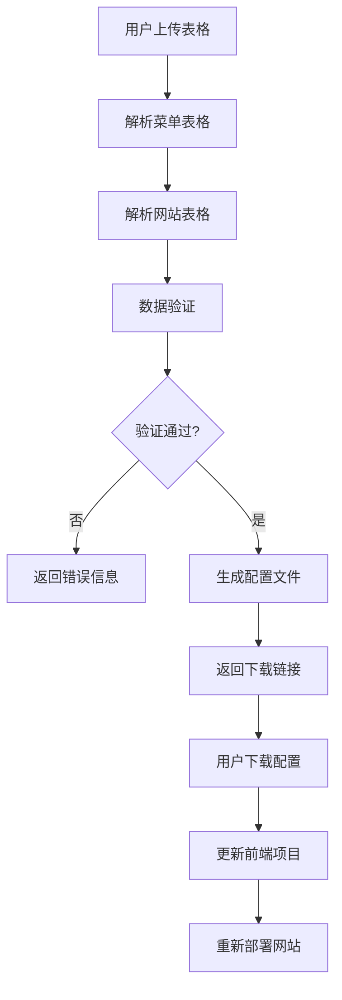
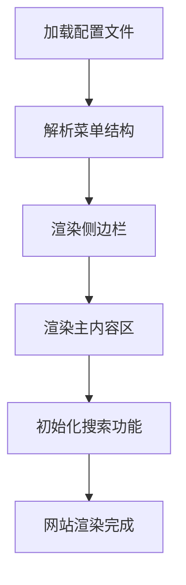

# 📋 Astro-Nav 开发计划

## 🎯 项目目标

创建一个配置驱动的导航网站解决方案，让用户通过表格数据快速生成专业的导航网站。

## 🏗️ 架构确认

### ✅ 已确认的技术方案

1. **前后端分离架构**
   - 前端：纯静态导航网站 (Astro)
   - 后端：配置生成器 (Astro + Serverless)

2. **部署平台**
   - 前端：GitHub Pages / Netlify / Vercel
   - 后端：Vercel / Netlify / Cloudflare

3. **工作流程**
   - 用户上传表格 → 后端解析生成配置 → 下载配置文件 → 更新前端项目 → 重新部署

## 📅 开发阶段

### 🚀 阶段1：基础架构 (当前阶段)

#### 已完成 ✅
- [x] 项目架构设计
- [x] 配置化前端重构
- [x] 类型定义完善
- [x] 文档体系建立
- [x] 表格格式设计

#### 进行中 🔄
- [ ] 完善配置化组件
- [ ] 优化现有导航功能
- [ ] 测试配置文件兼容性

#### 待完成 📋
- [ ] 创建示例配置文件
- [ ] 完善组件文档
- [ ] 添加配置验证逻辑

### 🛠️ 阶段2：后端开发 (下一阶段)

#### 核心功能
- [ ] 创建配置生成器项目
- [ ] 实现表格解析API
  - [ ] 菜单表格解析 (`/api/parse-menu`)
  - [ ] 网站表格解析 (`/api/parse-site`)
  - [ ] 配置文件生成 (`/api/generate-config`)
- [ ] 数据验证逻辑
  - [ ] 表头验证
  - [ ] 数据完整性检查
  - [ ] 关联关系验证
- [ ] 错误处理和用户反馈

#### 用户界面
- [ ] 文件上传界面
- [ ] 数据预览功能
- [ ] 错误提示显示
- [ ] 配置文件下载

#### API设计
```
POST /api/parse-menu
POST /api/parse-site  
POST /api/generate-config
GET  /api/templates/download
```

### 🎨 阶段3：前端优化 (第三阶段)

#### 功能增强
- [ ] 搜索功能优化
- [ ] 响应式设计完善
- [ ] 加载性能优化
- [ ] SEO优化

#### 用户体验
- [ ] 动画效果添加
- [ ] 主题切换功能
- [ ] 快捷键支持
- [ ] 无障碍访问支持

### 🔗 阶段4：集成测试 (第四阶段)

#### 端到端测试
- [ ] 表格上传流程测试
- [ ] 配置生成准确性测试
- [ ] 前端渲染效果测试
- [ ] 部署流程测试

#### 性能测试
- [ ] 前端加载速度测试
- [ ] 后端API响应时间测试
- [ ] 大文件处理能力测试

### 🚀 阶段5：部署上线 (最终阶段)

#### 生产环境部署
- [ ] 前端项目部署
- [ ] 后端服务部署
- [ ] 域名配置
- [ ] SSL证书配置

#### 文档完善
- [ ] 用户使用指南
- [ ] 开发者文档
- [ ] API接口文档
- [ ] 故障排除指南

## 🛠️ 技术实现细节

### 前端项目 (astro-nav-site)

#### 目录结构
```
src/
├── pages/
│   ├── index.astro              # 导航首页
│   ├── config-demo.astro        # 配置演示
│   └── [...slug].astro          # 动态路由
├── components/
│   ├── ConfigurableNavCard.astro # 配置化导航卡片
│   ├── ConfigurableSidebar.astro # 配置化侧边栏
│   └── SearchBox.astro          # 搜索组件
├── config/
│   └── site.json               # 核心配置文件
└── utils/
    ├── config.ts               # 配置读取工具
    └── search.ts               # 搜索功能
```

#### 核心功能
- 配置文件驱动的内容渲染
- 响应式导航界面
- 智能搜索功能
- SEO优化

### 后端项目 (astro-nav-generator)

#### 目录结构
```
src/
├── pages/
│   ├── index.astro             # 上传界面
│   └── api/
│       ├── parse-menu.ts       # 菜单解析
│       ├── parse-site.ts       # 网站解析
│       └── generate.ts         # 配置生成
├── utils/
│   ├── tableParser.ts          # 表格解析
│   ├── validator.ts            # 数据验证
│   └── configGenerator.ts      # 配置生成
└── types/
    └── tableImport.ts          # 类型定义
```

#### 核心功能
- Excel/CSV文件解析
- 数据验证和错误提示
- 配置文件生成
- 文件下载服务

## 📊 数据流设计

### 表格 → 配置文件转换流程



### 配置文件 → 网站渲染流程



## 🎯 里程碑

### 里程碑1：基础架构完成 (Week 1-2)
- [x] 项目架构设计
- [x] 配置化前端重构
- [x] 文档体系建立
- [ ] 示例配置完善

### 里程碑2：后端服务完成 (Week 3-4)
- [ ] 表格解析API实现
- [ ] 数据验证逻辑完成
- [ ] 配置生成功能完成
- [ ] 用户界面开发完成

### 里程碑3：集成测试完成 (Week 5)
- [ ] 端到端流程测试
- [ ] 性能优化
- [ ] 错误处理完善
- [ ] 用户体验优化

### 里程碑4：生产部署完成 (Week 6)
- [ ] 生产环境部署
- [ ] 文档完善
- [ ] 用户培训材料
- [ ] 项目正式发布

## 🔍 质量保证

### 代码质量
- TypeScript 严格模式
- ESLint 代码规范
- Prettier 代码格式化
- 单元测试覆盖

### 用户体验
- 响应式设计测试
- 跨浏览器兼容性测试
- 性能基准测试
- 无障碍访问测试

### 安全性
- 文件上传安全检查
- 数据验证和清理
- XSS 防护
- CSRF 防护

## 📈 成功指标

### 技术指标
- 前端加载时间 < 2秒
- API响应时间 < 5秒
- 支持文件大小 < 10MB
- 99% 正常运行时间

### 用户指标
- 配置生成成功率 > 95%
- 用户操作完成率 > 90%
- 错误恢复率 > 85%
- 用户满意度 > 4.5/5

## 🤝 团队协作

### 开发分工
- **前端开发**：配置化组件、用户界面
- **后端开发**：API服务、数据处理
- **测试**：功能测试、性能测试
- **文档**：用户指南、技术文档

### 沟通机制
- 每日站会：进度同步
- 周度回顾：里程碑检查
- 代码审查：质量保证
- 用户反馈：持续改进

---

*本开发计划将根据项目进展动态调整，确保按时高质量交付。*
