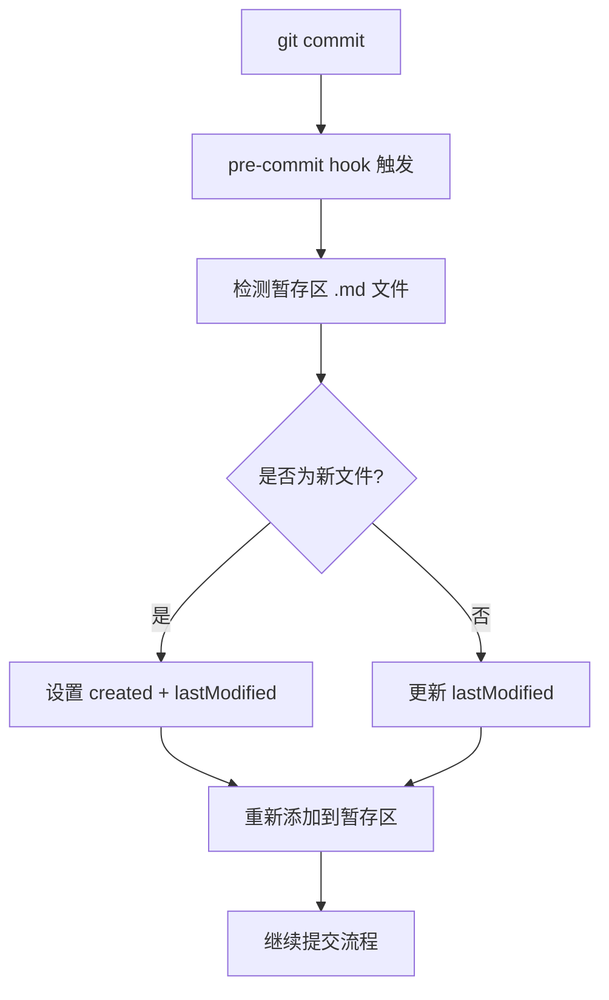

# 🕒 Git Hooks 自动时间戳更新指南

## 🎯 概述

本指南介绍如何使用 Git Hooks 自动更新文档的时间戳信息，实现 Front Matter 中 `created` 和 `lastModified` 字段的自动维护。

## ✨ 功能特性

### 🔄 自动更新机制
- **新文件**: 首次提交时自动设置 `created` 和 `lastModified`
- **已存在文件**: 修改后提交时自动更新 `lastModified`
- **智能检测**: 只处理暂存区中的 Markdown 文件
- **无侵入性**: 不影响其他 Git 工作流程

### 📋 支持的文件格式
- 所有包含 Front Matter 的 `.md` 文件
- 支持 `_index.md` 和普通文档文件
- 自动识别 YAML Front Matter 格式

## 🚀 快速开始

### 1. 安装 Git Hooks

```bash
# 运行安装脚本
node scripts/install-git-hooks.js
```

### 2. 验证安装

```bash
# 检查 hook 是否安装成功
ls -la .git/hooks/pre-commit

# 测试 hook 功能
echo "测试内容" > test.md
git add test.md
git commit -m "测试时间戳更新"
```

### 3. 正常使用

```bash
# 编辑文档
vim docs/example.md

# 添加到暂存区
git add docs/example.md

# 提交 (自动更新时间戳)
git commit -m "更新文档内容"
```

## 🔧 详细配置

### 安装脚本功能

#### `scripts/install-git-hooks.js`
- 自动安装 pre-commit hook
- 备份现有 hook 文件
- 设置正确的文件权限
- 验证安装是否成功

#### `scripts/git-hooks/pre-commit-timestamp.js`
- 检测暂存区中的 Markdown 文件
- 自动更新时间戳字段
- 处理新文件和已存在文件
- 将更新后的文件重新添加到暂存区

### Hook 工作流程



## 📝 时间戳格式

### Front Matter 格式
```yaml
---
# 时间信息
created: "2025-06-08"              # 首次创建日期
lastModified: "2025-06-08"         # 最后修改日期
---
```

### 日期格式规范
- **格式**: `YYYY-MM-DD` (ISO 8601 日期格式)
- **时区**: 使用本地时间
- **示例**: `"2025-06-08"`

## 🛠️ 高级配置

### 自定义时间戳字段

如果需要自定义字段名称，可以修改 `pre-commit-timestamp.js`:

```javascript
// 自定义字段名称
const CREATED_FIELD = 'created';
const MODIFIED_FIELD = 'lastModified';

// 或者使用其他格式
const CREATED_FIELD = 'dateCreated';
const MODIFIED_FIELD = 'dateModified';
```

### 排除特定文件

在脚本中添加文件过滤逻辑:

```javascript
function shouldUpdateFile(filePath) {
  // 排除特定目录
  if (filePath.startsWith('temp/')) return false;
  
  // 排除特定文件
  if (filePath.includes('README.md')) return false;
  
  return true;
}
```

## 🔍 故障排除

### 常见问题

#### 1. Hook 没有执行
```bash
# 检查 hook 文件是否存在
ls -la .git/hooks/pre-commit

# 检查文件权限 (Unix/Linux/macOS)
chmod +x .git/hooks/pre-commit
```

#### 2. Node.js 不可用
```bash
# 检查 Node.js 版本
node --version

# 如果没有安装，请安装 Node.js
# Windows: 下载安装包
# macOS: brew install node
# Linux: apt install nodejs npm
```

#### 3. 时间戳格式错误
- 确保 Front Matter 使用正确的 YAML 格式
- 检查引号和缩进是否正确
- 验证日期格式为 `YYYY-MM-DD`

### 调试模式

启用详细日志输出:

```bash
# 设置环境变量
export DEBUG_HOOKS=true

# 提交时查看详细日志
git commit -m "测试提交"
```

## 📊 最佳实践

### 1. 团队协作
- 所有团队成员都应安装相同的 hooks
- 在项目 README 中说明安装步骤
- 定期检查 hooks 是否正常工作

### 2. 文档维护
- 不要手动修改时间戳字段
- 让 Git hooks 自动管理时间信息
- 定期验证时间戳的准确性

### 3. 版本控制
- 将 hook 脚本纳入版本控制
- 记录 hook 配置的变更
- 为重要更新创建文档

## 🔄 卸载和更新

### 卸载 Hooks

```bash
# 删除 pre-commit hook
rm .git/hooks/pre-commit

# 恢复备份 (如果存在)
mv .git/hooks/pre-commit.backup.* .git/hooks/pre-commit
```

### 更新 Hooks

```bash
# 重新运行安装脚本
node scripts/install-git-hooks.js

# 脚本会自动备份现有 hook 并安装新版本
```

## 📚 相关资源

### 内部文档
- [开发指南](development-guide.md) - 整体开发流程
- [编码规范](coding-standards.md) - 代码质量标准
- [文档规范](../09-references/documentation-standards.md) - 文档编写规范

### 外部资源
- [Git Hooks 官方文档](https://git-scm.com/book/en/v2/Customizing-Git-Git-Hooks)
- [YAML Front Matter 规范](https://jekyllrb.com/docs/front-matter/)
- [ISO 8601 日期格式](https://en.wikipedia.org/wiki/ISO_8601)

---

**文档版本**: v1.0  
**创建日期**: 2025-06-08  
**最后更新**: 2025-06-08  
**维护者**: 项目团队
