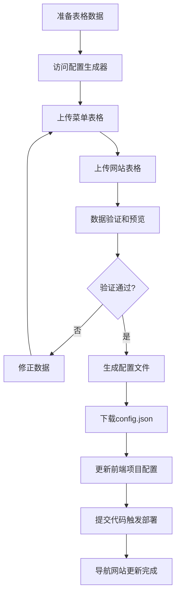
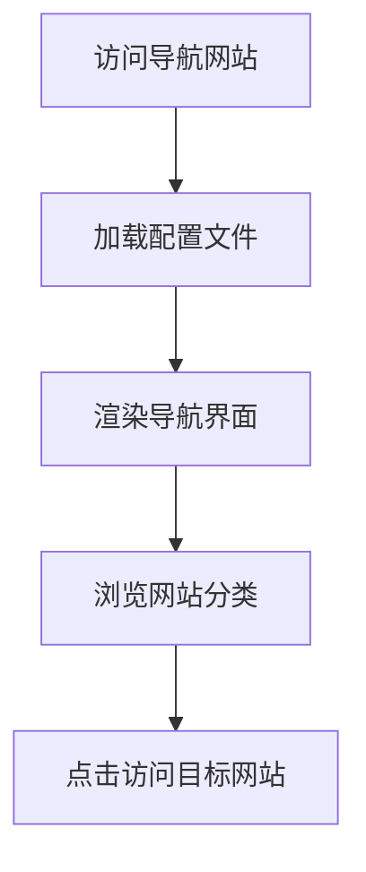

# 🏗️ Astro-Nav 项目架构方案

## 📋 项目概述

Astro-Nav 是一个配置驱动的导航网站解决方案，采用前后端分离架构，让用户可以通过表格数据快速生成专业的导航网站。

## 🎯 设计理念

### 核心原则
- **配置驱动** - 通过配置文件控制网站内容和结构
- **前后端分离** - 前端专注展示，后端专注数据处理
- **性能优先** - 前端纯静态部署，确保极速访问
- **用户友好** - 表格导入，降低技术门槛

### 技术优势
- ⚡ **极速性能** - 前端零API调用，纯静态加载
- 💰 **成本最低** - 前端免费托管，后端按需使用
- 🔧 **易于维护** - 配置文件版本控制，支持回滚
- 🚀 **快速部署** - 自动化构建和部署流程

## 🏗️ 架构设计

### 双项目架构

```
┌─────────────────────┐    配置文件    ┌─────────────────────┐
│                     │ ◄──────────── │                     │
│   项目1: 导航网站    │               │ 项目2: 配置生成器    │
│   (纯静态前端)       │               │   (后端服务)        │
│                     │               │                     │
│ • 读取配置文件       │               │ • 表格文件上传      │
│ • 渲染导航界面       │               │ • 数据解析验证      │
│ • 响应式设计         │               │ • 配置文件生成      │
│ • SEO优化           │               │ • 文件下载服务      │
│ • 极速加载          │               │ • API接口          │
└─────────────────────┘               └─────────────────────┘
        ↓                                       ↑
   最终用户访问                            开发者/管理员使用
```

## 📁 项目结构

### 项目1: 导航网站 (astro-nav-site)

```
astro-nav-site/
├── src/
│   ├── pages/
│   │   ├── index.astro              # 导航首页
│   │   ├── config-demo.astro        # 配置演示页面
│   │   └── [...slug].astro          # 动态路由
│   ├── components/
│   │   ├── Navigation.astro         # 导航组件
│   │   ├── SiteCard.astro          # 网站卡片
│   │   ├── CategoryCard.astro       # 分类卡片
│   │   └── Sidebar.astro           # 侧边栏
│   ├── layouts/
│   │   └── Layout.astro            # 页面布局
│   ├── config/
│   │   └── site.json               # 🎯 核心配置文件
│   ├── utils/
│   │   ├── configLoader.ts         # 配置读取工具
│   │   └── searchUtils.ts          # 搜索功能
│   └── types/
│       └── config.ts               # 类型定义
├── public/
│   ├── logos/                      # 网站Logo资源
│   └── favicon.ico                 # 网站图标
├── astro.config.mjs                # Astro配置
└── README.md                       # 使用说明
```

### 项目2: 配置生成器 (astro-nav-generator)

```
astro-nav-generator/
├── src/
│   ├── pages/
│   │   ├── index.astro             # 上传界面
│   │   ├── preview.astro           # 预览页面
│   │   └── api/
│   │       ├── parse-menu.ts       # 菜单解析API
│   │       ├── parse-site.ts       # 网站解析API
│   │       └── generate.ts         # 配置生成API
│   ├── components/
│   │   ├── FileUpload.astro        # 文件上传组件
│   │   ├── DataPreview.astro       # 数据预览组件
│   │   └── ErrorDisplay.astro      # 错误显示组件
│   ├── utils/
│   │   ├── tableParser.ts          # 表格解析逻辑
│   │   ├── dataValidator.ts        # 数据验证逻辑
│   │   └── configGenerator.ts      # 配置生成逻辑
│   ├── types/
│   │   └── tableImport.ts          # 导入类型定义
│   └── docs/
│       ├── TABLE_FORMAT.md         # 表格格式说明
│       └── API_DOCS.md             # API文档
├── public/
│   └── templates/                  # 表格模板文件
│       ├── menu-template.csv       # 菜单模板
│       └── site-template.csv       # 网站模板
├── vercel.json                     # Vercel部署配置
└── README.md                       # 使用说明
```

## 🔄 工作流程

### 开发者/管理员流程



### 最终用户流程



## 📊 数据流设计

### 表格数据格式

#### 菜单表格 (menu-template.csv)
```csv
menuId,menuName,menuIcon,menuType,parentMenuId,sortOrder
tracking,追踪系统,mdi:chart-line,single,,1
traffic,流量平台,mdi:traffic-light,tabs,,2
traffic-pop,PoP流量,mdi:popup,single,traffic,1
```

#### 网站表格 (site-template.csv)
```csv
menuId,title,description,url,advantages,pros,cons,tips
tracking,Binom,高性能tracker,https://binom.org,速度快;价格合理,性价比高,需要技术,选择SSD服务器
```

### 配置文件格式 (config.json)
```json
{
  "site": {
    "title": "我的导航网站",
    "description": "专业的导航平台",
    "logo": {
      "text": "MyNav",
      "href": "/"
    }
  },
  "categoryMap": {
    "追踪系统": "tracking",
    "流量平台": "traffic"
  },
  "menuItems": [
    {
      "name": "追踪系统",
      "href": "#tracking",
      "icon": "mdi:chart-line",
      "type": "single",
      "sites": [...]
    }
  ]
}
```

## 🚀 部署方案

### 平台选择

#### 配置生成器 (后端服务)
- **首选**: Vercel - Serverless Functions支持最佳
- **备选**: Netlify - Functions功能完善
- **备选**: Cloudflare Pages - Workers性能优秀

#### 导航网站 (静态前端)
- **首选**: GitHub Pages - 免费稳定
- **备选**: Netlify - 自动部署便捷
- **备选**: Vercel - 性能优秀

### 部署配置

#### Vercel部署 (配置生成器)
```json
{
  "functions": {
    "src/pages/api/*.ts": {
      "maxDuration": 30
    }
  },
  "rewrites": [
    {
      "source": "/api/(.*)",
      "destination": "/api/$1"
    }
  ]
}
```

#### GitHub Actions (导航网站)
```yaml
name: Deploy to GitHub Pages
on:
  push:
    branches: [ main ]
jobs:
  build-and-deploy:
    runs-on: ubuntu-latest
    steps:
      - uses: actions/checkout@v3
      - name: Setup Node.js
        uses: actions/setup-node@v3
      - name: Install and Build
        run: |
          npm install
          npm run build
      - name: Deploy
        uses: peaceiris/actions-gh-pages@v3
```

## 🎯 技术特性

### 前端特性
- ⚡ **极速加载** - 纯静态，无API调用
- 📱 **响应式设计** - 支持所有设备
- 🔍 **搜索功能** - 快速定位网站
- 🎨 **主题定制** - 支持多种样式
- 🔗 **SEO友好** - 静态页面，搜索引擎友好

### 后端特性
- 📊 **表格解析** - 支持Excel和CSV格式
- ✅ **数据验证** - 完整的错误检查和提示
- 🔄 **实时预览** - 上传后即时预览效果
- 📥 **文件下载** - 一键下载配置文件
- 🛡️ **安全可靠** - 数据处理安全，无存储风险

## 💡 使用场景

### 适用人群
- **个人开发者** - 快速搭建个人导航站
- **企业团队** - 内部资源导航管理
- **内容创作者** - 工具资源整理分享
- **技术社区** - 专业工具导航平台

### 典型应用
- Affiliate营销工具导航
- 设计资源导航站
- 开发工具集合
- 学习资源整理
- 企业内部系统导航

## 🔮 未来规划

### 短期目标 (1-3个月)
- [ ] 完成双项目基础架构
- [ ] 实现表格导入功能
- [ ] 支持基础的配置生成
- [ ] 完善文档和示例

### 中期目标 (3-6个月)
- [ ] 添加多主题支持
- [ ] 实现配置版本管理
- [ ] 支持批量操作
- [ ] 添加数据统计功能

### 长期目标 (6-12个月)
- [ ] 开发可视化编辑器
- [ ] 支持插件系统
- [ ] 实现用户管理
- [ ] 构建模板市场

## 📞 技术支持

- **项目地址**: https://github.com/your-org/astro-nav
- **文档站点**: https://astro-nav-docs.vercel.app
- **演示地址**: https://astro-nav-demo.github.io
- **问题反馈**: GitHub Issues

---

*本文档将随着项目发展持续更新，确保与实际实现保持同步。*
