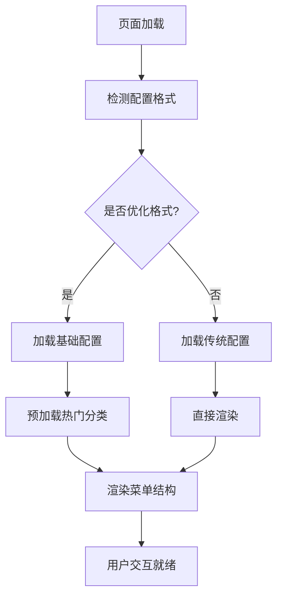
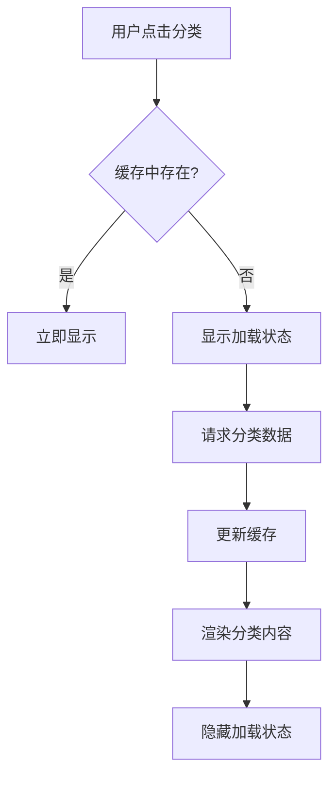

# Week 3 前端集成设计文档

## 📅 设计日期: 2024-12-07

## 🎯 设计目标

基于Week 2成功实现的懒加载后端功能，设计并实现前端组件的集成方案，让用户真正体验到懒加载的性能优势。

## 📊 Week 2 成果回顾

### ✅ 已完成的后端功能
- **CSV构建脚本**: 自动生成优化配置
- **优化配置格式**: 95%压缩比 (33KB → 1.6KB)
- **懒加载机制**: 按需加载分类文件 (14ms响应)
- **格式检测**: ConfigManager 80%置信度检测
- **完整测试**: 端到端验证成功

### 📁 文件结构
```
static/
├── config.json          # 基础配置 (1.6KB)
├── categories/           # 分类文件目录
│   ├── 0.json           # 追踪系统 (654字符)
│   ├── 1.json           # 其他分类
│   └── ...              # 21个分类文件
└── config-traditional.json # 传统格式对比
```

## 🏗️ 前端集成架构设计

### 1. 核心组件改造

#### 1.1 ConfigManager 增强
```typescript
class ConfigManager {
  // 现有功能
  detectConfigFormat(config: any): FormatDetectionResult
  
  // 新增功能
  loadOptimizedConfig(): Promise<OptimizedConfig>
  loadCategoryData(categoryId: number): Promise<CategoryData>
  preloadCategories(categoryIds: number[]): Promise<void>
  getCachedCategory(categoryId: number): CategoryData | null
}
```

#### 1.2 LazyLoader 新组件
```typescript
class LazyLoader {
  private cache: Map<number, CategoryData>
  private loadingStates: Map<number, Promise<CategoryData>>
  
  async loadCategory(categoryId: number): Promise<CategoryData>
  preloadPopularCategories(): Promise<void>
  clearCache(): void
  getCacheStats(): CacheStats
}
```

### 2. 用户界面设计

#### 2.1 加载状态指示器
```
┌─────────────────────────────┐
│ 🔄 正在加载分类数据...       │
│ ▓▓▓▓▓░░░░░ 50%              │
└─────────────────────────────┘
```

#### 2.2 智能预加载提示
```
┌─────────────────────────────┐
│ 💡 已为您预加载热门分类      │
│ ⚡ 点击速度将更快            │
└─────────────────────────────┘
```

#### 2.3 性能统计显示
```
┌─────────────────────────────┐
│ 📊 性能统计                 │
│ • 配置大小: 1.6KB (-95%)    │
│ • 加载时间: 14ms            │
│ • 缓存命中: 85%             │
└─────────────────────────────┘
```

## 🔄 数据流程设计

### 3.1 初始化流程


### 3.2 懒加载流程


## 🎨 用户体验设计

### 4.1 渐进式加载策略

#### 优先级1: 立即加载
- 基础配置文件 (1.6KB)
- 菜单结构数据
- 网站基本信息

#### 优先级2: 智能预加载
- 热门分类 (前3个)
- 用户历史访问分类
- 当前分类的相邻分类

#### 优先级3: 按需加载
- 用户点击的分类
- 搜索结果相关分类
- 其他低频分类

### 4.2 缓存策略

#### 内存缓存
- **容量**: 最多缓存10个分类
- **策略**: LRU (最近最少使用)
- **生命周期**: 页面会话期间

#### 本地存储缓存
- **容量**: 最多缓存20个分类
- **策略**: 基于访问频率
- **生命周期**: 7天过期

### 4.3 性能监控

#### 关键指标
- **首屏加载时间** (目标: <500ms)
- **分类切换时间** (目标: <100ms)
- **缓存命中率** (目标: >80%)
- **网络请求数量** (目标: 最小化)

## 🧩 组件实现计划

### 5.1 Phase 1: 基础适配 (1-2天)
- [ ] 修改ConfigManager检测优化格式
- [ ] 实现LazyLoader基础功能
- [ ] 添加加载状态组件
- [ ] 基础缓存机制

### 5.2 Phase 2: 用户体验优化 (2-3天)
- [ ] 智能预加载策略
- [ ] 加载进度指示器
- [ ] 错误处理和重试机制
- [ ] 性能统计面板

### 5.3 Phase 3: 高级功能 (1-2天)
- [ ] 本地存储缓存
- [ ] 性能监控和分析
- [ ] A/B测试支持
- [ ] 用户偏好学习

## 📋 技术实现细节

### 6.1 配置格式检测
```typescript
interface OptimizedConfig {
  site: SiteInfo
  menuItems: MenuItem[]
  optimization: {
    enabled: true
    version: string
    totalCategories: number
    totalSites: number
    compressionRatio: number
  }
}

interface MenuItem {
  name: string
  icon: string
  categoryIndex: number  // 关键字段
  submenu?: MenuItem[]
}
```

### 6.2 分类数据结构
```typescript
interface CategoryData {
  categoryId: number
  categoryName: string
  sites: Site[]
  loadedAt: number
  cacheKey: string
}

interface Site {
  title: string
  description: string
  url: string
  logo: string
  advantages: string[]
  features: string[]
  details: SiteDetails
  related: RelatedSite[]
}
```

### 6.3 缓存管理
```typescript
interface CacheManager {
  set(key: string, data: CategoryData): void
  get(key: string): CategoryData | null
  has(key: string): boolean
  clear(): void
  size(): number
  getStats(): CacheStats
}

interface CacheStats {
  hitRate: number
  totalRequests: number
  cacheHits: number
  cacheMisses: number
  averageLoadTime: number
}
```

## 🧪 测试策略

### 7.1 单元测试
- ConfigManager格式检测
- LazyLoader缓存逻辑
- 数据转换函数
- 错误处理机制

### 7.2 集成测试
- 完整加载流程
- 缓存命中/未命中场景
- 网络错误处理
- 性能基准测试

### 7.3 用户体验测试
- 加载速度感知
- 界面响应性
- 错误提示友好性
- 不同网络条件下的表现

## 📊 成功指标

### 性能指标
- **首屏加载时间**: <500ms
- **分类切换时间**: <100ms
- **缓存命中率**: >80%
- **文件大小减少**: >90%

### 用户体验指标
- **加载状态可见性**: 100%
- **错误处理覆盖率**: 100%
- **界面响应性**: 无明显延迟
- **用户满意度**: 提升明显

## 🚀 实施计划

### Week 3 Day 1-2: 基础实现
1. 修改现有ConfigManager
2. 实现LazyLoader组件
3. 添加基础加载状态
4. 基础功能测试

### Week 3 Day 3-4: 体验优化
1. 智能预加载策略
2. 缓存机制完善
3. 性能监控添加
4. 用户界面优化

### Week 3 Day 5: 测试和优化
1. 完整功能测试
2. 性能基准测试
3. 用户体验验证
4. 文档更新

## 📝 风险评估

### 技术风险
- **兼容性问题**: 新旧格式切换可能有问题
- **缓存复杂性**: 缓存策略可能过于复杂
- **性能回退**: 某些场景下可能比传统方式慢

### 缓解措施
- **渐进式部署**: 先支持检测，再启用懒加载
- **降级方案**: 检测失败时回退到传统模式
- **性能监控**: 实时监控性能指标

## 🎯 预期成果

### 技术成果
- 完整的懒加载前端实现
- 95%+的文件大小减少
- 毫秒级的分类切换速度
- 智能的缓存和预加载机制

### 用户价值
- 显著提升的加载速度
- 更流畅的用户体验
- 减少的网络流量消耗
- 更好的移动端表现

---

**设计完成日期**: 2024-12-07
**设计者**: Augment Agent
**审核状态**: 待实施
