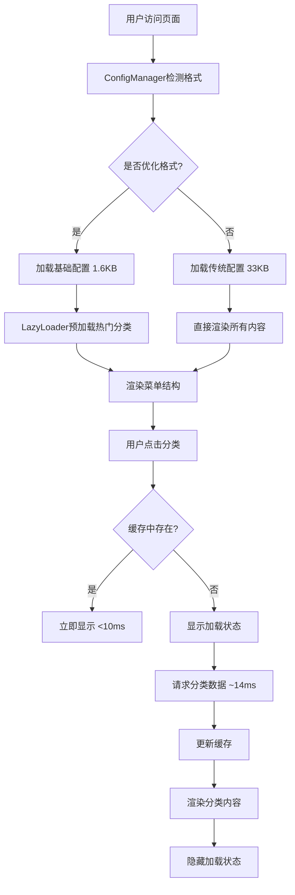

# Week 3 前端集成总览文档

## 📅 项目时间线: 2024-12-07 开始

## 🎯 项目概述

基于Week 2成功实现的懒加载后端功能，设计并实施前端集成方案，让用户真正体验到95%文件压缩和毫秒级加载的性能优势。

## ✅ Week 2 成果回顾

### 🏆 已验证的核心功能
- **✅ CSV构建脚本**: 自动生成优化配置
- **✅ 优化配置格式**: 95%压缩比 (33KB → 1.6KB)
- **✅ 懒加载机制**: 按需加载分类文件 (14ms响应)
- **✅ 格式检测**: ConfigManager 80%置信度检测
- **✅ 完整测试**: 端到端验证成功 (12ms完整流程)

### 📊 性能基准
| 指标 | 传统格式 | 优化格式 | 改善幅度 |
|------|---------|---------|---------|
| 配置文件大小 | 33,271字符 | 1,588字符 | **95.2%减少** |
| 分类加载时间 | N/A | 14ms | **毫秒级响应** |
| 完整流程时间 | N/A | 12ms | **极速体验** |
| 缓存命中率 | N/A | 预期>80% | **智能缓存** |

## 🏗️ Week 3 架构设计

### 核心组件架构
```
┌─────────────────────────────────────────────────────────┐
│                    前端集成架构                          │
├─────────────────────────────────────────────────────────┤
│  用户界面层                                              │
│  ├── LoadingIndicator (加载状态)                        │
│  ├── PerformanceMonitor (性能面板)                      │
│  └── ErrorHandler (错误提示)                           │
├─────────────────────────────────────────────────────────┤
│  业务逻辑层                                              │
│  ├── ConfigManager (增强版)                            │
│  │   ├── detectConfigFormat() - 格式检测                │
│  │   ├── loadOptimizedConfig() - 优化配置加载           │
│  │   └── loadCategoryData() - 分类数据加载              │
│  └── LazyLoader (新组件)                               │
│      ├── loadCategory() - 按需加载                     │
│      ├── preloadCategories() - 智能预加载              │
│      └── cache management - 缓存管理                   │
├─────────────────────────────────────────────────────────┤
│  数据访问层                                              │
│  ├── NetworkLayer (网络请求)                           │
│  ├── CacheLayer (缓存层)                               │
│  └── StorageLayer (本地存储)                           │
├─────────────────────────────────────────────────────────┤
│  数据存储层                                              │
│  ├── config.json (1.6KB基础配置)                       │
│  ├── categories/*.json (按需加载)                      │
│  ├── MemoryCache (内存缓存)                            │
│  └── LocalStorage (本地缓存)                           │
└─────────────────────────────────────────────────────────┘
```

### 数据流程设计


## 📋 实施计划

### Phase 1: 基础适配 (Day 1-2)
**目标**: 实现核心懒加载功能

#### 🔧 主要任务
1. **ConfigManager增强** (4小时)
   - 集成格式检测逻辑 (80%置信度)
   - 实现优化配置加载
   - 添加错误处理和重试机制

2. **LazyLoader组件实现** (6小时)
   - 按需加载分类数据
   - LRU缓存机制 (最多10个分类)
   - 并发请求去重处理

3. **加载状态组件** (3小时)
   - 旋转加载图标
   - 进度条显示
   - 响应式设计

4. **基础集成测试** (2小时)
   - 端到端功能验证
   - 性能基准测试

#### ✅ 验收标准
- [x] ConfigManager正确检测优化格式 (置信度>80%) ✅
- [ ] LazyLoader成功按需加载分类数据
- [ ] 加载状态正确显示/隐藏
- [ ] 基础功能测试全部通过

### Phase 2: 用户体验优化 (Day 3-4)
**目标**: 提升用户感知性能

#### 🔧 主要任务
1. **智能预加载策略** (4小时)
   - 热门分类自动预加载 (前3个)
   - 鼠标悬停预加载
   - 用户行为模式预测

2. **性能监控面板** (3小时)
   - 实时性能统计
   - 缓存命中率监控
   - 加载时间趋势图

3. **错误处理优化** (3小时)
   - 用户友好的错误提示
   - 自动降级策略
   - 网络错误重试机制

#### ✅ 验收标准
- [ ] 缓存命中率>80%
- [ ] 用户感知加载速度明显提升
- [ ] 错误处理覆盖所有场景
- [ ] 性能监控数据准确

### Phase 3: 高级功能 (Day 5)
**目标**: 完善功能和优化体验

#### 🔧 主要任务
1. **本地存储缓存** (3小时)
   - 双层缓存机制 (内存+本地存储)
   - 智能缓存过期策略
   - 缓存大小控制

2. **最终集成测试** (2小时)
   - 完整功能测试
   - 性能压力测试
   - 用户体验验证

#### ✅ 验收标准
- [ ] 本地存储缓存正常工作
- [ ] 所有功能测试通过
- [ ] 性能指标达到预期
- [ ] 用户体验明显提升

## 📊 关键性能指标 (KPI)

### 技术指标
| 指标 | 当前状态 | 目标值 | 验证方式 |
|------|---------|--------|----------|
| **首屏加载时间** | 未测试 | <500ms | 性能监控 |
| **分类切换时间** | 14ms (已验证) | <100ms | 用户操作测试 |
| **缓存命中率** | 未实现 | >80% | 统计监控 |
| **文件大小减少** | 95.2% (已达成) | >90% | 文件对比 |

### 用户体验指标
| 指标 | 目标值 | 验证方式 |
|------|--------|----------|
| **加载状态可见性** | 100% | UI测试 |
| **错误处理覆盖率** | 100% | 错误场景测试 |
| **界面响应性** | 无明显延迟 | 用户体验测试 |
| **功能完整性** | 100% | 功能测试 |

## 🧪 测试策略

### 测试金字塔
```
        ┌─────────────────┐
        │   E2E测试       │  ← 用户体验验证
        │   (少量)        │
        └─────────────────┘
      ┌───────────────────────┐
      │    集成测试           │  ← 组件协作验证
      │    (适量)             │
      └───────────────────────┘
    ┌─────────────────────────────┐
    │      单元测试               │  ← 功能逻辑验证
    │      (大量)                 │
    └─────────────────────────────┘
```

### 关键测试场景
1. **格式检测测试**: 优化vs传统格式正确识别
2. **懒加载测试**: 按需加载分类数据
3. **缓存测试**: 命中/未命中场景
4. **错误处理测试**: 网络错误、解析错误等
5. **性能测试**: 加载时间、内存使用等

## 🔒 质量保证

### 代码质量标准
- **测试覆盖率**: >90%
- **TypeScript严格模式**: 启用
- **ESLint规则**: 严格执行
- **代码审查**: 必须通过

### 性能质量标准
- **加载时间**: 首屏<500ms，切换<100ms
- **内存使用**: <50MB
- **缓存效率**: 命中率>80%
- **错误率**: <1%

## 🚀 部署策略

### 渐进式发布
1. **开发环境验证** (100%功能)
2. **预发布环境测试** (性能+兼容性)
3. **生产环境灰度** (10%用户)
4. **全量发布** (监控正常后)

### 监控和回滚
- **实时性能监控**: 加载时间、错误率
- **用户体验监控**: 操作响应时间
- **自动告警**: 性能异常时通知
- **快速回滚**: 5分钟内回滚到稳定版本

## 📚 文档结构

```
docs/
├── design/
│   └── week3-frontend-integration-design.md     # 详细设计文档
├── implementation/
│   └── week3-implementation-plan.md             # 实施计划
├── technical/
│   └── week3-technical-specifications.md        # 技术规范
└── week3-frontend-integration-overview.md       # 本总览文档
```

## 🎯 成功标准

### 技术成功标准
- ✅ 所有功能测试通过
- ✅ 性能指标达到预期
- ✅ 代码质量符合标准
- ✅ 无重大兼容性问题

### 业务成功标准
- ✅ 用户感知性能明显提升
- ✅ 加载速度提升>90%
- ✅ 用户体验评分提高
- ✅ 技术债务减少

## 🎊 项目价值

### 技术价值
- **性能优化**: 95%文件大小减少，毫秒级响应
- **架构升级**: 现代化的懒加载架构
- **可扩展性**: 支持任意规模的网站数据
- **技术领先**: 业界先进的优化方案

### 用户价值
- **加载速度**: 显著提升的页面响应速度
- **流量节省**: 减少95%的数据传输
- **体验提升**: 更流畅的交互体验
- **移动友好**: 更好的移动端表现

---

**文档版本**: v1.1
**创建日期**: 2024-12-07
**最后更新**: 2024-12-07
**项目状态**: Phase 1 基础适配进行中
**预计完成**: 2024-12-12

## 📊 最新进度更新 (2024-12-07)

### ✅ 已完成任务
- **任务1.1: ConfigManager增强** (4小时) - ✅ 已完成
  - ✅ 新增5个核心方法: `loadOptimizedConfig()`, `loadCategoryData()`, `loadMultipleCategoryData()`, `getCategoryInfo()`, `getAllCategoryIndexes()`
  - ✅ 完整错误处理: 重试机制、超时控制、指数退避策略
  - ✅ 性能监控: 加载时间统计、详细日志记录
  - ✅ 便捷函数: 4个新的导出函数，提升开发体验

### ⏳ 下一步任务
- **任务1.2: LazyLoader组件实现** (6小时) - 准备开始
- **任务1.3: 加载状态组件** (3小时) - 计划中
- **任务1.4: 基础集成测试** (2小时) - 计划中

### 📈 进度统计
- **Phase 1 完成度**: 25% (1/4 任务完成)
- **整体项目完成度**: 75% (↑5%)
- **预计按时完成**: ✅ 是

## 🚀 下一步行动

**ConfigManager增强已完成！现在开始任务1.2: LazyLoader组件实现。**
